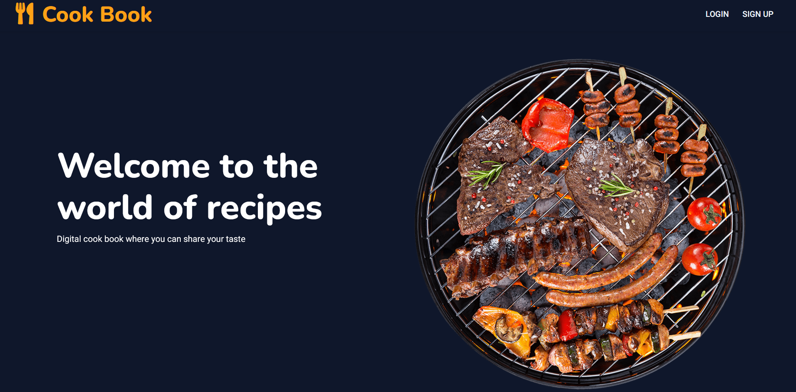
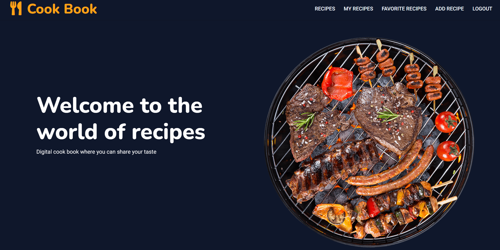
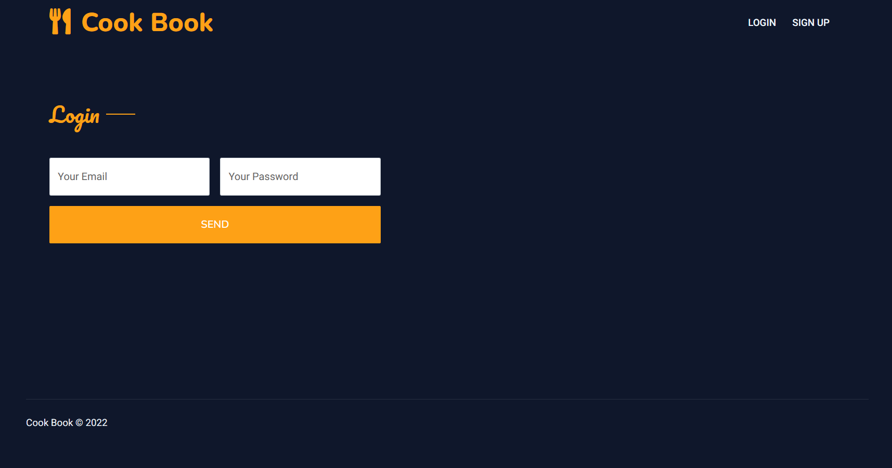
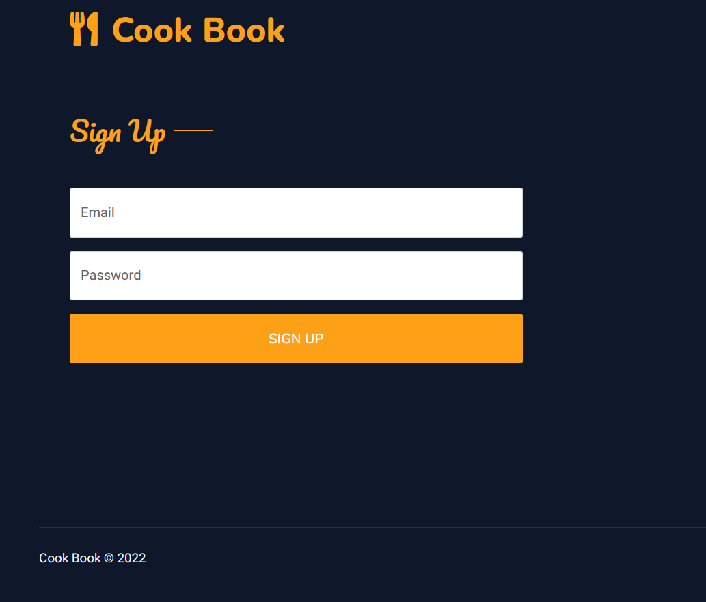
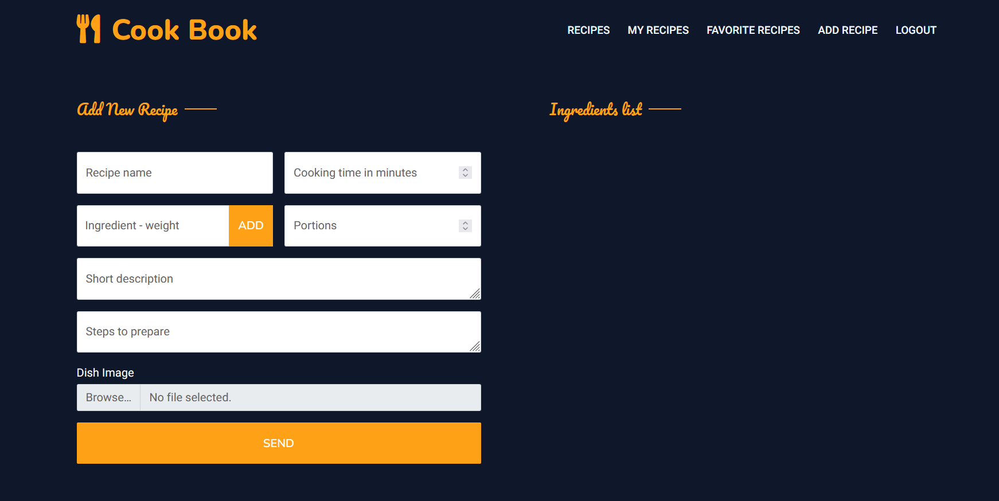
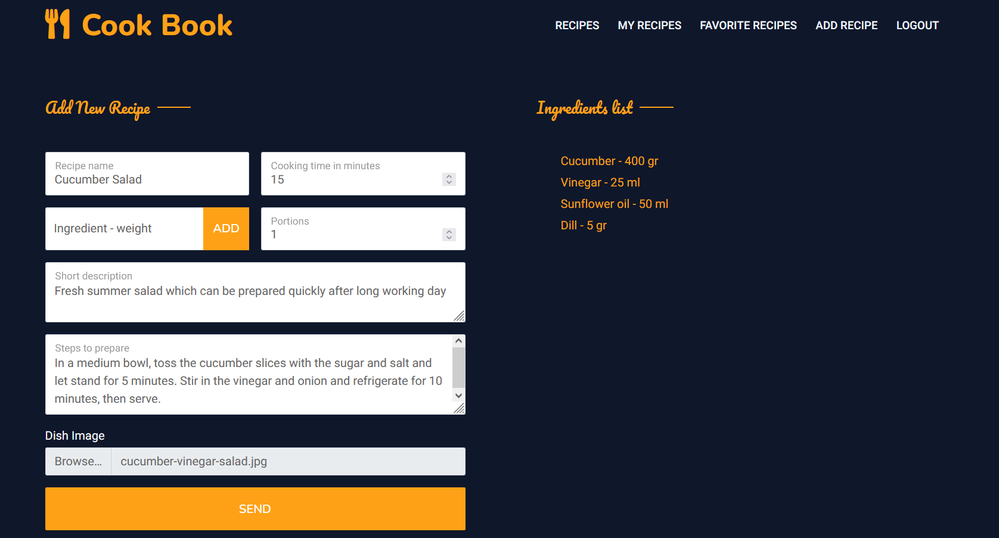
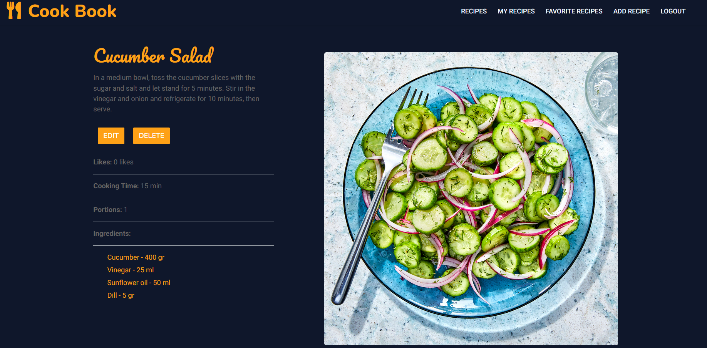
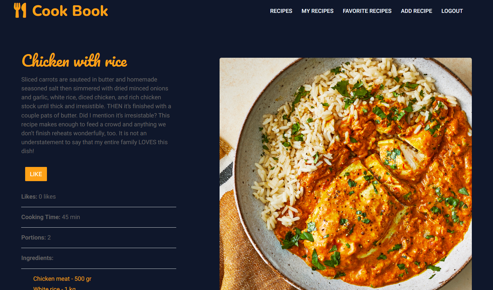
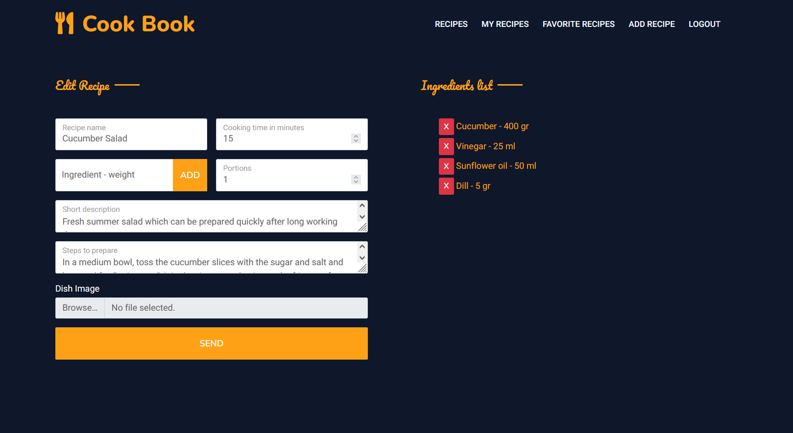

# Cook Book - Digital cooking book for sharing recipes

## Author

 [Hristo Topalov](https://www.linkedin.com/in/hristo-topalov/)

 Demo project which runs on .NET 6 Api backend and ReactJS frontend, supports CRUD operations over recipe collections.

 ## Roles

* Guest
* User

## Getting Started

Site guest (**visitor**) options:
* can visit Landing page(component) which offers limited functionality(guest can see four recipes as a sample to the web application but can't perform any operations over them)
* can visit Signup and Login pages to authorize or register in to the application.

**Registered user** options:
* gains access to the application
* can create new recipes and like already created ones by other users(liked recipes are stored as favorite, so they can be checked any time later)
* can edit or delete owned recipes

## Template Layout

* *Free Boostrap 5 responsive template from the web* - https://themewagon.com/themes/restoran-free-responsive-bootstrap-5-restaurant-website-template/ 

## Project technology stack

### Programming Languages
* C#
* Java Script
* T-SQL
* HTML
* CSS

### Frameworks

* ReactJS - https://reactjs.org/
* ASP.NET 6 - https://dotnet.microsoft.com/en-us/apps/aspnet
* Entity Framework - https://docs.microsoft.com/en-us/ef/
* MS SQL Server 2019 - https://www.microsoft.com/en-us/sql-server/sql-server-2019
* Bootstrap 5 - https://getbootstrap.com/

## Used techniques
* Services
* Web Api
* AJAX
* Eager Loading when using Entity Framework to avoid N + 1 problem and have more control over data
* Mapping domain models to view or service models to avoid leakage of unnecessary properties to users and reduce data transfer.

## Application Layers
* Data layer (Backend)
* Business layer (Backend)
* Presentation layer (Frontend)

## Security
* Generation of JWT tokens when user logs in order to make authenticated request to backend(server).
* Auth guard and private route guard to check if unauthorized user is trying to access authenticated content of the application.

## Typical Workflow

When guest visit the application he will have the following options:
* Can click on sample recipes cards on landing page and see details about them but can't perform any operations over them.
* Can use register or login links in navbar in order to create new profile or login in existing one.

If user is already registered and logs in, will have the following options:
* Create new recipe, delete or edit only owned recipes and like other users recipes.
* Can access all recipes in the application.
* Can access favorite recipes(previously liked ones).

## Samples

**Landing for guest**
 

**Landing for user**
 

**Login**
 

**Signup**
 

**New recipe**
 

**New recipe with input**

**Details for owner**
 

**Details for non-owner with like option**

**Edit recipe**
